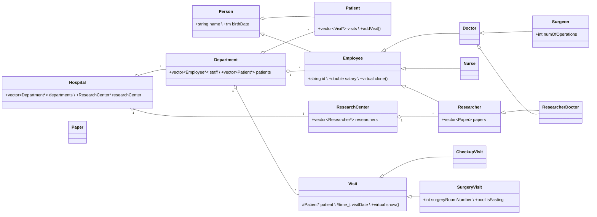

# 🏥 Hospital-Management System (C++17, OOP Final Project)

[](https://en.cppreference.com/w/cpp/17)
[](#building)
[](LICENSE)

> **Author:** Yariv Shossberger  
> **Course:** Object-Oriented Programming, Afeka College (2025)

---

## 📑 Table of Contents
1. [Project Overview](#project-overview)  
2. [Domain Model](#domain-model)  
3. [Class Diagram](#class-diagram)  
4. [Getting Started](#getting-started)  
5. [Building](#building)  
6. [Sample Run](#sample-run)  

---

## Project Overview
A **console-based hospital‑management system** showcasing modern C++17 object‑oriented design:

* **Encapsulation & RAII** (rule‑of‑3/5)  
* **Multiple inheritance & virtual bases** (e.g., `ResearcherDoctor`)  
* **Polymorphism via `clone()` pattern & `override` methods**  
* **STL containers** (`std::vector`, `std::map`)  
* **Exception + RTTI checks** for safe down‑casting  

---

## Domain Model
* **People:** `Person` → `Patient` and `Employee`  
  * `Employee` → `Doctor`, `Nurse`, `Researcher`  
    * `Surgeon` (doctor + extra stats)  
    * `ResearcherDoctor` (multiple‑inherit: researcher + doctor)  
* **Places:** `Hospital` (owns `Department`s & a `ResearchCenter`)  
* **Events:** `Visit` (abstract) → `CheckupVisit`, `SurgeryVisit`  
* **Research:** `Paper`, `ResearchCenter`, array of `Researcher*`

---

## Class Diagram


---

## Getting Started

### Prerequisites
| Tool | Version | Notes |
|------|---------|-------|
| **C++ compiler** | C++17‑compatible | g++ ≥ 9, clang ≥ 10, MSVC ≥ 19.28 |
| **Make/CMake**   | optional        | Simple `Makefile` supplied |

```bash
git clone https://github.com/yarivschoss/Final_Project.git
cd Final_Project
```

---

## Building

### 🔧 GNU g++
```bash
g++ -std=c++17 -Wall src/*.cpp -o hospital
./hospital
```

### 💻 Visual Studio
Open **`Final_Project.sln`**, choose *Debug* or *Release*, then **Build & Run** (Ctrl + F5).

---

## Sample Run
```text
Menu:
1. Add Department to Hospital
2. Add Employee to Hospital
3. Add Researcher to Research Center
4. Add Employee to Department
5. Add Paper to Researcher
6. Add Patient
7. Add Visit
8. Show Patients visits by Department
9. Find Patient by ID
10. Show system's info
11. Compare Researchers by number of papers
12. Clear console
13. Exit
Enter your choice: _
```

*(Options cascade into sub‑menus for adding specific staff types, researchers, papers, etc.)*

